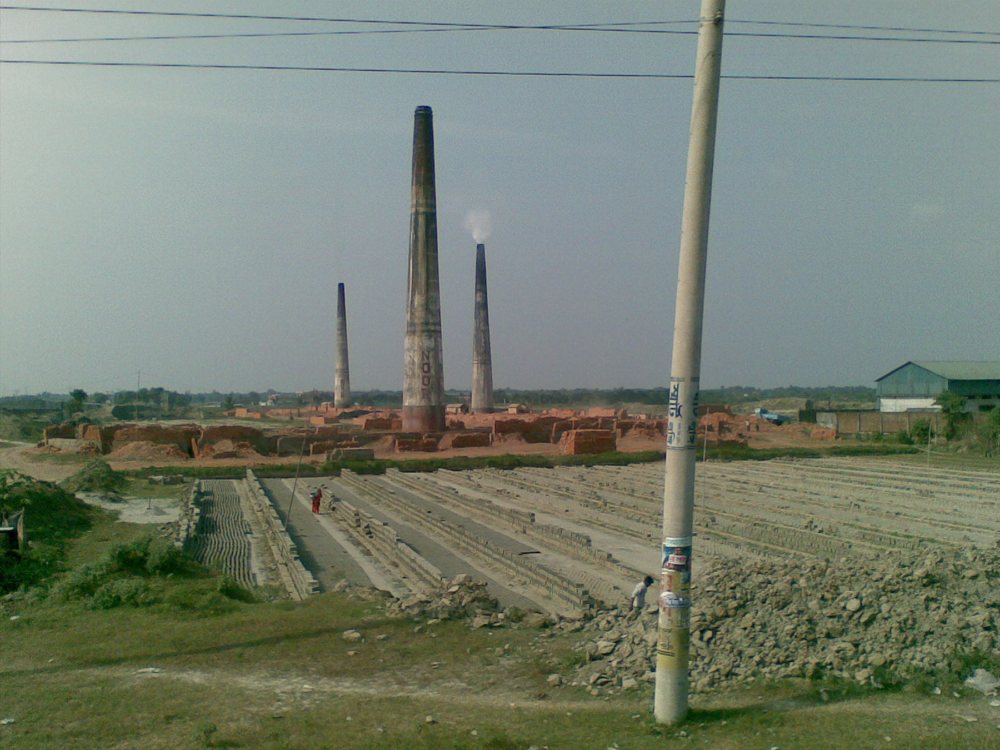
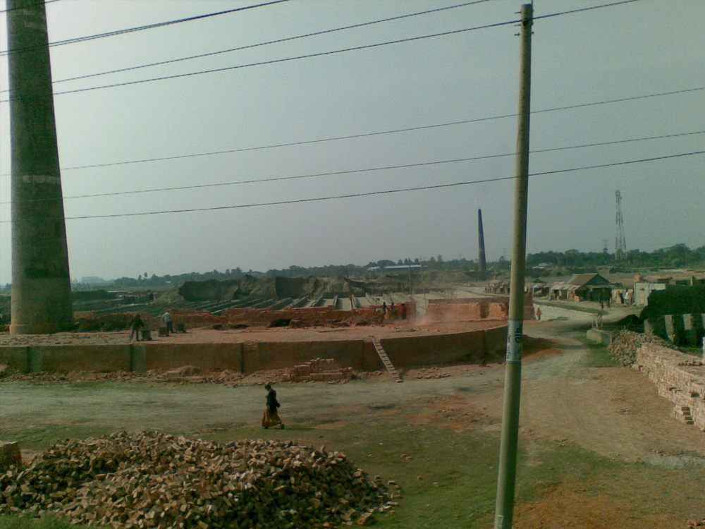

# Brickmaking: History, Materials, Processes, and Production Planning

## Executive Summary

Brickmaking combines mineral processing, ceramic forming, controlled drying, high-temperature firing, quality testing, emissions control, and material handling. The basic sequence is stable across modern clay-brick plants: **mine or receive clay/shale → crush and grind → blend and temper → form → dry → fire → cool → inspect and ship**. The U.S. Environmental Protection Agency’s AP-42 background material identifies stiff-mud extrusion as the predominant brick-forming route in the United States, with soft-mud molding and dry pressing as alternatives. EPA reports that stiff-mud material entering the vacuum chamber is typically **14–18% moisture**, while soft-mud clay is typically **20–30% moisture**. [EPA AP-42, Brick and Structural Clay Product Manufacturing](https://www.epa.gov/sites/default/files/2020-10/documents/c11s03.pdf)

Modern production is usually organized around continuous drying and firing. EPA describes the tunnel kiln as the most common kiln type for brick manufacturing, with a typical tunnel length of roughly **104–152 m (340–500 ft)** and a firing-zone maximum around **1090 °C (2000 °F)**. For most brick types, the full drying, firing, and cooling sequence takes about **20–50 hours**. These are industry-level reference values rather than design specifications for every clay body or kiln. [EPA AP-42](https://www.epa.gov/sites/default/files/2020-10/documents/c11s03.pdf)

Quality control should be tied to the product specification and the current test standard rather than to generic strength targets. As of August 2026, ASTM lists **ASTM C67/C67M-25** as the active standard test-method suite for sampling and testing brick and structural clay tile. Its scope includes compressive strength, absorption, saturation coefficient, freeze/thaw testing, efflorescence, initial rate of absorption, size, warpage, void area, and related measurements. Product specifications such as ASTM C62, C216, C652, and C902 define requirements for particular brick classes and uses. **ASTM C109 is a hydraulic-cement-mortar test and should not be cited as the governing brick compressive-strength method.** [ASTM C67/C67M](https://store.astm.org/standards/c67)

Environmental compliance is plant- and jurisdiction-specific. EPA’s brick and structural clay manufacturing materials identify particulate matter, combustion products, metals, organic compounds, and fluorides among relevant emission categories. In the United States, major-source brick and structural-clay facilities may also fall under the federal **Brick and Structural Clay Products NESHAP**. Raw-material crushing, grinding, transfer, and cleanup can also create respirable-dust hazards, including crystalline-silica exposure where silica-bearing material is handled. [EPA Brick and Structural Clay Products NESHAP](https://www.epa.gov/stationary-sources-air-pollution/brick-and-structural-clay-products-national-emission-standards)

The inherited report previously presented universal-looking capital-cost ranges for artisanal, medium, and large plants. Those figures have been removed. There is no defensible single CAPEX/OPEX ladder independent of site, clay preparation, quarry scope, throughput, kiln technology, emissions controls, automation, buildings, utilities, local labor, and financing. Production planning should instead proceed from a defined product specification and throughput target to a mass-and-energy balance, equipment sizing, vendor quotations, civil/site estimates, permitting requirements, commissioning allowance, and contingency.

The most credible current technology trend is decarbonization of kiln heat rather than a wholesale abandonment of fired clay. In March 2026 Wienerberger announced a **£6 million** conversion program at its Denton, Greater Manchester plant aimed at creating what it describes as the world’s first commercial-scale hydrogen-fired brick plant. Its stated program targets one kiln fully operational on hydrogen, or both kilns partly converted, by **autumn 2027**, with full transition to 100% hydrogen scheduled to begin in **autumn 2028**. The company projects an annual reduction of more than 11,600 tonnes of CO₂, equivalent to about 9% of Wienerberger Limited’s annual Scope 1 and 2 emissions, and reports that cross-industry testing gives confidence that brick strength, appearance, and performance can be maintained. [Wienerberger, March 2026](https://www.wienerberger.co.uk/about-us/news-blogs/wienerberger-secures-funding-for-first-hydrogen-fired-brick-kiln.html)

## Historical Lineage

Brick is one of the oldest manufactured building materials. Early settled societies formed earth and mud into regular units and dried them in the sun; fired brick later extended durability and weather resistance. Over centuries the technology evolved from intermittent firing and local hand molding toward mechanized preparation, continuous forming, engineered dryers, and continuous kilns.

The nineteenth century was decisive for industrial scale. Continuous kiln concepts such as the Hoffmann ring kiln reduced the repeated heat-up and cool-down losses of isolated batch firing. Twentieth-century plants increasingly adopted tunnel kilns, mechanical handling, vacuum extrusion, controlled drying, and laboratory quality control. Contemporary development focuses less on changing the basic ceramic transformation than on improving energy efficiency, emissions control, automation, process sensing, and low-carbon heat sources.

A simplified lineage is therefore:

1. hand-formed and sun-dried earth units;
2. fired brick in periodic or clamp-style kilns;
3. mechanized grinding, mixing, and pressing/extrusion;
4. continuous Hoffmann and tunnel-kiln production;
5. automated handling and process control; and
6. current work on electrification, hydrogen, waste-heat recovery, alternative raw materials, and lower-carbon masonry systems.

## Raw Materials and Body Preparation

The main raw materials for conventional fired brick are surface clays and shales. Their mineralogy, particle-size distribution, soluble salts, sulfur compounds, carbonaceous material, iron content, and fluxing constituents influence plasticity, drying shrinkage, firing behavior, color, porosity, and defect risk.

EPA’s process description begins with mining or receipt of clay/shale, followed by primary crushing, grinding and screening, and storage before forming. In practice, raw-material qualification should precede detailed plant design. A useful characterization program can include:

- particle-size analysis;
- moisture content;
- plastic and liquid limits where relevant;
- X-ray fluorescence for bulk chemistry;
- X-ray diffraction for mineralogical characterization;
- loss on ignition;
- soluble-salt or sulfur screening where efflorescence or gaseous emissions are concerns; and
- laboratory drying/firing trials on representative blends.

The purpose is not merely to describe the clay but to establish its process window. A body that extrudes well at one moisture content may crack under an aggressive drying schedule; a clay that produces acceptable color at one firing temperature may bloat or warp if its organic or fluxing content changes. Quarry variability therefore belongs inside the quality system rather than being treated as a one-time laboratory question.

Sand, grog (crushed fired ceramic), shale, colorants, and other additives may be used to modify plasticity, shrinkage, texture, color, or firing behavior. Any additive that materially changes chemistry or emissions should be evaluated as part of both product qualification and environmental permitting.

## Forming Methods

### Stiff-Mud Extrusion

EPA describes stiff-mud extrusion as the predominant brick-forming process. Ground raw material is mixed with water in a pug mill, passes through a vacuum chamber for de-airing, and is continuously augered or extruded through a die. EPA reports **14–18% moisture** for material entering the vacuum chamber. The extruded column is then cut into individual units, commonly with wires. [EPA AP-42](https://www.epa.gov/sites/default/files/2020-10/documents/c11s03.pdf)

Extrusion suits high-throughput production because mixing, de-airing, forming, surface treatment, cutting, and handling can be integrated into a continuous line. Product geometry, die design, body rheology, vacuum level, extrusion pressure, moisture, and cutting accuracy become important process variables.

### Soft-Mud Molding

EPA describes soft-mud molding as appropriate for clay too wet for stiff-mud extrusion. The clay is mixed to approximately **20–30% moisture** and formed in molds before drying. [EPA AP-42](https://www.epa.gov/sites/default/files/2020-10/documents/c11s03.pdf)

Soft-mud methods remain useful where a molded texture or particular heritage appearance is desired, but they generally imply a different handling and drying regime from stiff-mud extrusion.

### Dry Pressing

In the dry-press process described by EPA, relatively dry clay is formed in steel molds under pressure. EPA’s background document notes forming pressures of roughly **3.43–10.28 MPa (500–1500 psi)** for the process it describes and also notes that U.S. use of dry pressing for brick may be limited. [EPA AP-42](https://www.epa.gov/sites/default/files/2020-10/documents/c11s03.pdf)

Dry pressing should therefore be treated as a distinct process option rather than as the default route for an ordinary U.S. brick plant.

## Drying and Firing

Freshly formed brick contains enough water that direct exposure to firing temperature would cause severe cracking or spalling. Drying therefore precedes firing and must be controlled to prevent damaging moisture gradients.

EPA reports that industrial dryers may use waste heat from the kiln cooling zone and may operate around **204 °C (400 °F)**, while noting that plant configurations differ. After drying, bricks enter the kiln. The tunnel kiln is the most common type described in EPA’s U.S. process background. A representative tunnel kiln is about **104–152 m** long and includes heating/firing/cooling functions; the firing zone is typically maintained near a maximum of **1090 °C**. The entire drying, firing, and cooling sequence commonly takes **20–50 hours** for most brick types. [EPA AP-42](https://www.epa.gov/sites/default/files/2020-10/documents/c11s03.pdf)

Those values are useful for conceptual plant planning, but a production firing curve should be developed from the actual body. Relevant transformations include free-water removal, clay-mineral dehydration/dehydroxylation, oxidation of organics and sulfur-bearing species, mineral reactions, sintering/vitrification, controlled atmosphere effects, and cooling. Rate limits can occur during both heating and cooling, especially with thick units or bodies prone to thermal gradients.

Natural gas has historically been a common kiln fuel in U.S. plants, with other fuels used in some facilities. Future plants should not assume the historical fuel mix is fixed; the economically preferred heat source will increasingly depend on local electricity, gas, hydrogen, carbon policy, emissions limits, and infrastructure.

*Figure: Traditional brickfield with outdoor drying and clamp-style firing. Modern industrial plants generally use enclosed controlled dryers and kilns.*

## Quality Control and Current Standards

A brick plant should separate **test methods** from **product specifications**.

### ASTM C67/C67M

As of August 2026, ASTM lists **ASTM C67/C67M-25, Standard Test Methods for Sampling and Testing Brick and Structural Clay Tile**, as active. Its scope includes procedures for:

- modulus of rupture;
- compressive strength;
- absorption;
- saturation coefficient;
- freeze/thaw performance;
- efflorescence;
- initial rate of absorption;
- weight, size, and warpage;
- length change; and
- void area. 

The current standard should be consulted directly when defining sampling, conditioning, specimen preparation, test apparatus, calculations, and acceptance reporting. [ASTM C67/C67M](https://store.astm.org/standards/c67)

The earlier version of this report incorrectly paired **ASTM C109** with brick compressive-strength testing. C109 is a hydraulic-cement-mortar compressive-strength method; it is not the governing unit-test standard for fired brick. Brick compressive-strength work in this context should be specified through C67/C67M together with the applicable brick product specification.

### Product Specifications

Different brick products are governed by different specifications. As of August 2026, ASTM’s active catalog includes, among others:

- **ASTM C62-25** — Building Brick (Solid Masonry Units Made From Clay or Shale); [ASTM C62](https://store.astm.org/standards/c62)
- **ASTM C216-26a** — Facing Brick (Solid Masonry Units Made From Clay or Shale); [ASTM C216](https://store.astm.org/standards/c216)
- **ASTM C652-24** — Hollow Brick (Hollow Masonry Units Made From Clay or Shale); [ASTM C652](https://store.astm.org/standards/c652)
- **ASTM C902-22** — Pedestrian and Light Traffic Paving Brick; [ASTM C902](https://store.astm.org/standards/c902)

A plant should therefore start with the intended product and market specification, then design the clay body, dimensions, firing curve, and quality-control plan around the applicable requirements. A single generic target such as “17 MPa minimum brick strength” is not an adequate substitute for the relevant specification because requirements vary by product class and exposure.

### Practical Quality Program

A production quality system should include at least:

1. incoming raw-material checks and blend control;
2. forming moisture and dimensional control;
3. drying-loss and defect monitoring;
4. kiln-zone temperature and atmosphere records;
5. finished-unit dimensions and appearance;
6. strength and absorption testing under the applicable standard;
7. durability testing when required by the product specification and intended exposure; and
8. lot traceability so failures can be tied back to raw-material and process records.

Advanced microscopy, X-ray CT, mercury intrusion porosimetry, or mineralogical analysis can be useful in development and failure analysis, but they do not replace routine production tests.

## Common Failure Modes

### Drying Cracks and Warpage

Uneven moisture, excessive drying rate, nonuniform airflow, or differential shrinkage can crack or distort green brick before it reaches the kiln. The corrective response is process-specific: adjust body moisture and particle distribution, loading geometry, airflow, temperature/humidity schedule, or drying time.

### Underfiring

A body that does not reach the required thermal work may retain excessive porosity or insufficient ceramic bonding. Symptoms can include low strength, high absorption, soft texture, or off-specification color. Corrective action should be based on kiln records and fired-property testing rather than temperature alone.

### Overfiring, Bloating, or Deformation

Excessive thermal work, gas evolution during vitrification, or an unsuitable body chemistry can cause swelling, glassy deformation, or dimensional loss. Organic matter, sulfur-bearing constituents, flux content, and firing atmosphere can all contribute.

### Efflorescence and Soluble Salts

Soluble salts can migrate with moisture and crystallize at the surface. Control begins with raw-material and process-water chemistry and may also involve additives, firing behavior, storage, and masonry exposure conditions.

### Lime or Inclusion Pop-Outs

Coarse reactive inclusions can hydrate or expand after firing and damage the surface. Raw-material crushing, screening, blending, and mineralogical control are therefore part of defect prevention.

Failure analysis should tie visible symptoms to production history rather than rely on one-to-one folklore rules. A cracked brick may reflect raw material, extrusion, drying, kiln loading, thermal gradients, or some combination.

## Porosity, Absorption, and Microstructure

Fired brick is a porous ceramic. Strength, water absorption, capillary transport, salt movement, and freeze/thaw behavior depend not merely on total porosity but on pore size, connectivity, mineralogy, microcracking, and degree of sintering.

Greater vitrification often lowers open porosity and increases strength, but there is no universal optimum porosity that applies to every clay body and service condition. Product development should therefore use the applicable absorption, saturation, strength, and durability requirements as engineering constraints rather than optimizing only for maximum density.

Laboratory development may use microscopy, XRD, SEM, porosimetry, or CT to explain why two bodies with similar bulk absorption behave differently. Those tools are most valuable when tied to a controlled firing matrix and standardized finished-unit tests.

## Environmental and Occupational Controls

EPA identifies brick-manufacturing emissions that can include particulate matter, sulfur oxides, nitrogen oxides, carbon monoxide, carbon dioxide, metals, organic compounds, and fluorides. Emission magnitude depends on raw-material chemistry, fuel, process configuration, and control equipment. Grinding and screening are important particulate sources; kilns are major sources of both particulate and gaseous emissions. [EPA AP-42](https://www.epa.gov/sites/default/files/2020-10/documents/c11s03.pdf)

In the United States, major-source brick and structural-clay facilities may be subject to **40 CFR Part 63, Subpart JJJJJ**, the Brick and Structural Clay Products Manufacturing NESHAP. EPA’s current program page should be treated as the starting point for federal hazardous-air-pollutant requirements, with state and local air permits adding facility-specific obligations. [EPA Brick and Structural Clay Products NESHAP](https://www.epa.gov/stationary-sources-air-pollution/brick-and-structural-clay-products-national-emission-standards)

Dust control is also an occupational-health issue. Crushing, grinding, dry transfer, housekeeping, maintenance, and cutting of silica-bearing materials can create respirable dust. A plant must evaluate its actual exposure profile and comply with applicable workplace standards rather than assume that ordinary nuisance-dust controls are sufficient. OSHA’s [Respirable Crystalline Silica](https://www.osha.gov/silica-crystalline) materials provide the federal occupational-safety starting point.

Other site-specific environmental questions include stormwater, quarry disturbance, wastewater or wash-water management, waste brick and dust recycling, fuel storage, noise, truck traffic, and land-use permitting.

*Figure: Small brickfield with outdoor drying and clamp kilns. Industrial environmental controls depend heavily on kiln enclosure, fuel, exhaust handling, and material-handling design.*

## Production Scale and Economic Planning

The earlier report presented a table assigning universal CAPEX ranges to “artisanal,” “small,” “medium,” and “large” brick plants. That presentation was too precise for the evidence and has been removed.

A brick-plant budget is a **project estimate**, not a lookup-table property of daily brick count. Two plants with the same nominal output can have radically different capital requirements depending on:

- whether clay is mined on site or purchased prepared;
- crushing, grinding, and blending requirements;
- product size and forming technology;
- dryer and kiln type;
- fuel and utility infrastructure;
- required emissions-control equipment;
- automation and material handling;
- warehouse and packaging scope;
- local civil works and buildings;
- laboratory and quality-control scope;
- quarry development and environmental mitigation;
- local labor and construction costs; and
- commissioning, spares, engineering, financing, and contingency.

A defensible planning sequence is:

1. define product specifications and annual saleable output;
2. estimate yield and scrap/recycle rates;
3. establish raw-material and finished-product mass balances;
4. define forming, drying, and firing technology;
5. build an energy balance and utility demand;
6. size major equipment and buffer/storage capacity;
7. obtain budgetary quotations from qualified equipment vendors;
8. estimate buildings, quarry/site work, controls, and utilities;
9. model staffing, maintenance, refractories, fuel/electricity, consumables, testing, and logistics;
10. include commissioning, ramp-up loss, contingency, and working capital; and
11. test the project against product price, utilization, fuel-price, yield, and financing sensitivities.

This approach produces a plant-specific estimate with traceable assumptions. Exact cost figures from generic business-plan websites should not be treated as engineering benchmarks.

## Equipment Architecture by Scale

Although universal costs are inappropriate, equipment scope does change predictably with scale.

### Laboratory and Pilot Scale

A development line may use:

- bench or small pug mills;
- small extruders or laboratory presses;
- controlled drying ovens or chambers;
- an instrumented laboratory kiln;
- balances and dimensional inspection equipment;
- a compression test frame and absorption-testing setup; and
- mineralogical/chemical testing in-house or through an external laboratory.

The purpose is process development, not commercial throughput. Equipment should allow moisture, forming pressure, drying schedule, and firing curve to be varied deliberately.

### Commercial Scale

A commercial line commonly adds:

- primary and secondary size reduction;
- screens and controlled raw-material storage;
- continuous mixing/pugging and vacuum extrusion;
- automatic cutting and setting;
- controlled dryers;
- continuous kiln cars and tunnel kiln or another selected kiln system;
- conveying and robotic or mechanized handling;
- emissions controls and monitoring;
- automated process data collection; and
- packaging and finished-goods handling.

Redundancy and maintainability become more important as output rises because a single extruder, dryer fan, kiln conveyor, or control-system failure can stop the entire line.

## Research, Development, and Scale-Up

A staged development program can reduce the risk of committing to a kiln and forming line before the clay body is understood.

| Phase | Principal work | Exit criterion |
|---|---|---|
| Raw-material characterization | Representative quarry sampling, mineralogy, chemistry, particle-size and plasticity work | Stable candidate raw-material envelope |
| Laboratory body development | Blend matrix, forming trials, drying shrinkage, firing curves, initial C67/C67M testing | One or more bodies capable of meeting target product requirements |
| Pilot forming and drying | Continuous or semi-continuous extrusion/pressing, cutting, handling, dryer trials | Reproducible green units without unacceptable drying loss |
| Pilot firing | Instrumented firing curves, atmosphere and thermal-work trials | Fired units repeatedly meet dimensional, absorption, strength, and appearance requirements |
| Pre-production validation | Larger lots, raw-material variability trials, durability testing, quality-plan development | Process window and control plan demonstrated across realistic variation |
| Commissioning | Full equipment installation, hot commissioning, operator training, capability studies | Stable saleable output under production conditions |

Design of experiments is particularly useful because clay blend, particle size, moisture, extrusion condition, dryer schedule, peak thermal work, and atmosphere interact. A sequence of controlled experiments is usually more informative than changing one process setting after another in reaction to defects.

## Current Technology Direction

### Heat Decarbonization

Kiln heat is the central decarbonization challenge for conventional fired brick. Options under development or deployment include improved heat recovery, electrification where high-temperature electric systems and grid capacity are viable, biomass or alternative fuels in some contexts, and hydrogen where production and delivery infrastructure can support it.

A concrete current example is Wienerberger’s Denton program in the United Kingdom. In March 2026 the company announced a **£6 million** hydrogen conversion project. The company’s stated milestones are one kiln fully operational—or both partly converted—on hydrogen by **autumn 2027**, followed by full transition to 100% hydrogen beginning in **autumn 2028**. Wienerberger projects more than 11,600 tonnes of annual CO₂ reduction, equivalent to about 9% of Wienerberger Limited’s Scope 1 and 2 emissions, and reports that testing indicates no necessary loss of brick strength, appearance, or performance. [Wienerberger announcement](https://www.wienerberger.co.uk/about-us/news-blogs/wienerberger-secures-funding-for-first-hydrogen-fired-brick-kiln.html)

That project should be understood as a commercial-scale demonstration of an alternative kiln-energy system, not evidence that hydrogen is already the dominant or universally economical route for brickmaking.

### Automation and Sensing

Commercial plants increasingly benefit from continuous data on moisture, extrusion pressure, dryer conditions, kiln-zone temperatures, oxygen/atmosphere, fuel use, and product dimensions. Machine vision and statistical process control can improve defect detection and process stability. The practical value of “AI” in this setting is not generic automation hype but the ability to detect drift, correlate defects with process history, and keep production inside a validated operating window.

### Alternative Masonry Materials

Unfired compressed-earth products, alkali-activated/geopolymer units, concrete masonry, autoclaved products, and additive-manufactured materials can reduce or eliminate conventional clay firing in some applications. They should not, however, be treated as interchangeable with fired clay brick: raw materials, structural properties, moisture behavior, durability mechanisms, standards, and permitting can differ substantially.

## Production-Planning Checklist

Before committing capital, a brick project should have defensible answers to the following questions:

- What exact product specification will be sold?
- What are the representative quarry/raw-material ranges, not just one laboratory sample?
- What saleable annual output and operating days are assumed?
- What forming route is compatible with the body and product geometry?
- What drying window avoids cracking at the required throughput?
- What firing curve and thermal work meet the product specification?
- What fuel or heat source is actually available at the site?
- What air permit and emissions controls are required?
- What silica/dust and machine-safety controls are required?
- What percentage of green and fired scrap can be recycled into the process?
- What maintenance outage and refractory strategy supports the utilization assumption?
- Which quality tests are required by the governing product specification?
- What are the vendor-quoted equipment, installation, building, utility, and commissioning costs?
- How sensitive is project economics to fuel price, utilization, yield, labor, and product selling price?

A technically mature business case begins with those constraints and then derives equipment and economics from them. Reversing the sequence—starting from a generic “cost per brick plant” and inventing a process around the budget—creates avoidable engineering and financial risk.

## Conclusion

Modern brickmaking is a mature ceramic process with a clear industrial grammar: controlled raw materials, appropriate forming moisture, gradual drying, sufficient but not excessive firing, standardized finished-unit testing, and disciplined emissions and dust control. The most reliable design references are the applicable product specifications, current test standards, primary regulatory sources, representative raw-material trials, and equipment/vendor data for the actual project.

The stable engineering core of the process remains recognizable across decades. What changes quickly are the surrounding constraints: active standard editions, environmental requirements, fuel economics, emissions-control expectations, automation, and decarbonization technology. Production planning should therefore distinguish **durable process knowledge** from **current claims that require dated verification**. That distinction is more useful than a long catalog of equipment prices or generic plant-size cost ranges, and it makes the report maintainable as technology and regulation change.
