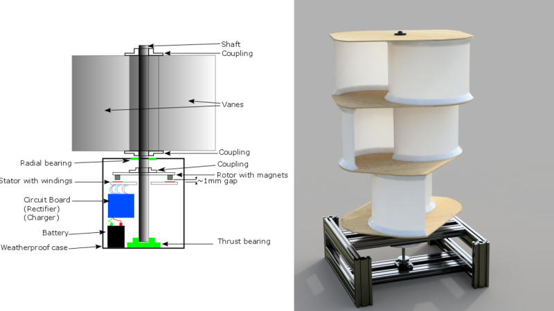

# Savonius Wind Turbines – Comprehensive Design & DIY Guide

## Executive Summary

A Savonius turbine is a vertical-axis, predominantly drag-driven wind turbine. Its characteristic advantages are mechanical simplicity, omnidirectional wind acceptance, relatively strong starting torque, and operation at low rotational speed. Its principal disadvantage is aerodynamic efficiency: an unaugmented Savonius rotor normally extracts substantially less power from a given swept area than a well-designed lift-based horizontal-axis turbine.

This guide is an **engineering design reference**, not a certified construction drawing. It explains the physics, geometry, power estimates, generator matching, site assessment, fabrication planning, testing, and safety questions that must be resolved before a small Savonius system is built. Worked numbers are illustrative calculations under explicitly stated assumptions; they are not universal component specifications.

Two recent literature reviews are useful starting points for Savonius aerodynamic design: the 2023 *Processes* review of interior and exterior performance modifications and the 2024 *Energies* review of multi-parameter performance improvements. The former reports classical two-blade cases spanning a wide range of measured or modeled power coefficients and shows that carefully designed internal or external modifications can improve performance, sometimes substantially. These results should be treated as **configuration-specific experimental or numerical findings**, not as guarantees for a home-built rotor. See [Deda Altan & Gultekin (2023)](https://www.mdpi.com/2227-9717/11/5/1473) and [the 2024 Savonius review](https://www.mdpi.com/1996-1073/17/15/3708).

For an actual small-wind installation, aerodynamic design is only one subsystem. The U.S. Department of Energy's current [Small Wind Guidebook](https://www.energy.gov/cmei/systems/windexchange/small-wind-guidebook) emphasizes site-specific wind assessment, annual-energy estimation from a turbine power curve and wind-speed distribution, permitting, electrical interconnection, maintenance, and overspeed protection. [IEC 61400-2:2013](https://webstore.iec.ch/en/publication/5433), including its 2019 corrigendum, provides the principal small-wind safety framework for design, installation, maintenance, operation, protection mechanisms, electrical systems, mechanical systems, support structures, foundations, and load interconnection.

## 1. What a Savonius Rotor Does

A classical Savonius rotor uses two curved buckets arranged around a vertical shaft. The concave advancing bucket experiences greater drag than the returning convex bucket, producing net torque. Because the axis is vertical and the rotor presents usable geometry to wind from any horizontal direction, a classical Savonius rotor does not require a yaw mechanism.

The basic rotor is illustrated by the package-local conceptual image below. It is retained as a design aid, not as a fabrication drawing; dimensions and structural details must be established for the actual machine.

*Figure 1. Conceptual Savonius arrangements. Component proportions in this legacy illustration are not engineering specifications.*

The rotor's simplicity does not make the complete turbine simple in the engineering sense. A functioning system still needs a structurally adequate shaft and support, bearings, a generator and coupling, overspeed protection, electrical conversion and protection, weatherproofing, a safe tower or mounting structure, and an installation appropriate to the local wind environment.

## 2. Power, Torque, and Rotational Speed

### 2.1 Power available in the wind

For air density \(\rho\), swept area \(A\), and instantaneous wind speed \(v\), the kinetic power crossing the rotor's swept area is

\[
P_{wind}=\frac{1}{2}\rho A v^3.
\]

For a straight Savonius rotor of height \(H\) and overall diameter \(D\), the projected swept area is approximately

\[
A=HD.
\]

The mechanical shaft power is represented by

\[
P_{shaft}=C_p P_{wind}=\frac{1}{2}\rho A v^3 C_p,
\]

where \(C_p\) is the power coefficient for the specific rotor at the specific operating point. Electrical output is lower still:

\[
P_{elec}=\eta_{system}P_{shaft},
\]

where \(\eta_{system}\) includes generator, rectifier/controller, wiring, drivetrain, and other conversion losses relevant to the configuration.

The familiar Betz value of about 0.593 is the ideal actuator-disk upper bound on steady extraction from an unconstrained wind stream; it is not a performance expectation for a Savonius rotor and is not specifically a "lift-turbine limit." Savonius rotors operate well below it. The 2023 review reports classical two-blade cases with \(C_p\) values up to roughly 0.25 in the studies it compiles, while highly modified configurations can report larger values. Such values depend strongly on geometry, test method, Reynolds number, load, blockage, and augmentation and should not be transferred blindly to a different machine.

### 2.2 A transparent illustrative calculation

The following table uses one deliberately simple assumption set:

- air density: \(\rho=1.225\,kg/m^3\);
- swept area: \(A=1.0\,m^2\);
- assumed rotor power coefficient: \(C_p=0.20\);
- assumed downstream mechanical-to-electrical efficiency: \(\eta_{system}=0.50\).

These assumptions are **not a specification or prediction for a particular build**.

| Instantaneous wind speed | Wind power through 1 m² | Illustrative shaft power at Cp=0.20 | Illustrative electrical power at 50% downstream efficiency | Energy in 24 h only if that wind were constant |
| ---: | ---: | ---: | ---: | ---: |
| 3 m/s | 16.5 W | 3.3 W | 1.7 W | 0.040 kWh |
| 5 m/s | 76.6 W | 15.3 W | 7.7 W | 0.184 kWh |
| 8 m/s | 313.6 W | 62.7 W | 31.4 W | 0.753 kWh |
| 12 m/s | 1058.4 W | 211.7 W | 105.8 W | 2.54 kWh |

The last column is **not an annual-energy method**. Wind speed varies continuously, and power depends on \(v^3\). The cube of annual mean wind speed is not generally the mean of \(v^3\). DOE therefore recommends estimating annual energy from the particular turbine power curve together with site wind data, tower height, micro-siting, wind-speed frequency distribution when available, elevation, and relevant losses. For serious sizing, use measured or defensible site data rather than treating a mean wind speed as a constant wind.

### 2.3 Tip-speed ratio and RPM

Tip-speed ratio is

\[
\lambda=\frac{\omega R}{v},
\]

where \(R=D/2\). Therefore

\[
RPM=\frac{60\lambda v}{\pi D}.
\]

For example, a 1 m diameter rotor at 5 m/s would turn at about 76 RPM if \(\lambda=0.8\), or about 95 RPM if \(\lambda=1.0\). The appropriate operating \(\lambda\) comes from the actual rotor's torque/power curve and generator load, not from a universal Savonius constant. Classical drag-driven Savonius machines generally operate at low tip-speed ratios, often below or around one, but geometry and augmentation matter.

Low RPM is a major generator-matching constraint. A generator advertised as "500 W" is not automatically capable of producing useful voltage or power at 80–150 RPM.

## 3. Rotor Geometry

### 3.1 Blade count

Two buckets are the conventional baseline. The 2023 review finds that, in the studies it compiles, two-blade configurations generally have higher peak power coefficients than comparable three-blade configurations, while additional blades can alter starting behavior and torque ripple. This is a design trade rather than a universal command: blade count should be evaluated with the complete rotor geometry and loading.

### 3.2 Overlap

The overlap gap between buckets affects leakage flow and negative torque. Literature commonly studies overlap ratios from zero through several tenths of rotor diameter. Several configurations summarized in the 2023 review report favorable performance around an overlap ratio near 0.15, but the optimum is experiment-specific. A prototype may therefore use a modest adjustable overlap for testing, but "15%" should not be treated as an immutable design law.

### 3.3 Aspect ratio, end plates, blade form, and stages

Height-to-diameter ratio affects swept area, structural slenderness, shaft/bearing loading, and aerodynamic behavior. End plates can reduce tip leakage in some configurations. Helical/twisted blades and staged rotors can reduce torque pulsation but complicate fabrication and structural design. External deflectors or guide vanes can greatly alter reported \(C_p\), but they also change directional response, loads, footprint, and the meaning of the bare-rotor swept area.

For a first prototype, it is generally easier to learn from a mechanically simple rotor with measurable geometry than from a highly augmented design whose published performance depends on carefully reproduced flow-control structures.

## 4. Sizing a Prototype Without Pretending It Is a Certified Machine

A useful sizing sequence is:

1. Define the purpose: aerodynamic experiment, battery trickle charging, sensor power, mechanical demonstration, or an actual energy system.
2. Measure or obtain defensible wind data for the proposed hub height and site.
3. Choose a conservative provisional \(C_p\) based on comparable tested geometry; document the source and do sensitivity calculations rather than using a single optimistic value.
4. Choose provisional downstream efficiency from the actual generator/controller/drivetrain data rather than a generic percentage.
5. Calculate required swept area over a range of wind speeds.
6. Match the expected rotor torque/RPM envelope to a generator and controller.
7. Design the rotating structure, support, tower/foundation, braking/protection, and electrical system for appropriate operating and extreme conditions.
8. Prototype and measure before relying on the system for an important load.

For example, under the illustrative assumptions \(\rho=1.225\,kg/m^3\), \(C_p=0.20\), and 6 m/s instantaneous wind, each square metre of swept area yields about **26.5 W of shaft power**. A 100 W shaft-power target would therefore require about **3.8 m²** under those assumptions. If downstream efficiency were only 50%, a 100 W electrical target at that same instantaneous wind would require about **7.6 m²**. Neither calculation means the turbine will average 100 W over time.

## 5. Shaft, Bearings, Frame, Tower, and Foundation

Do not select shaft diameter, bearing size, tower section, fasteners, welds, or foundation dimensions from a generic internet recipe. They depend on rotor mass and inertia, geometry, imbalance, generator and brake torque, gust and extreme-wind loads, fatigue cycles, support spacing, material properties, corrosion environment, soil/foundation conditions, and the applicable code or standard.

[IEC 61400-2](https://webstore.iec.ch/en/publication/5433) explicitly treats small-wind protection mechanisms, mechanical systems, support structures, foundations, and electrical interconnection as parts of the safety problem and cautions about simplified equations. For a machine whose failure could injure people or damage property, structural design should be checked by an appropriately qualified engineer for the actual site and materials.

Practical prototype principles include:

- keep the rotating assembly balanced;
- minimize unsupported shaft length consistent with the design;
- account for both radial and axial/thrust loads in bearing selection;
- use positive retention so a failed fastener does not release a blade or rotor section;
- guard accessible rotating couplings, belts, gears, and pinch points;
- design for inspection and controlled maintenance rather than requiring work on an energized or freely rotating system;
- treat corrosion, water ingress, fatigue, and fastener loosening as lifecycle issues rather than one-time assembly details.

## 6. Fabrication and the Used-Container Hazard

Curved buckets can be made from purpose-bought sheet or tube, fabricated composite shells, or other materials whose history and mechanical properties are known. Reused drums are common in hobby demonstrations, but they create a serious hot-work hazard when their contents are unknown.

OSHA [29 CFR 1910.252(a)(3)](https://www.osha.gov/laws-regs/regulations/standardnumber/1910/1910.252) states that welding, cutting, or other hot work must not be performed on used drums, barrels, tanks, or other containers until they have been cleaned thoroughly enough to ensure that flammable material and substances capable of producing flammable or toxic vapors are absent; connections must be disconnected or blanked. Hollow spaces and containers must be vented, and inert-gas purging is recommended.

Accordingly:

- **Prefer new material or containers with a known safe history.**
- Do not cut or weld a mystery drum merely because it appears empty.
- Do not treat rinsing with water as proof that a former chemical or fuel container is safe for hot work.
- Use fabrication methods, personal protective equipment, ventilation, fire prevention, and qualified procedures appropriate to the actual material and process.

This guide does not provide a substitute hot-work procedure.

## 7. Generator Matching and Electrical Architecture

### 7.1 Start from the rotor operating envelope

The generator should be selected from expected torque and RPM, not only nameplate watts. Obtain or measure the generator's voltage-versus-speed and torque/current behavior. A permanent-magnet generator or suitably characterized permanent-magnet motor can be convenient at low speed, but a device intended for hundreds or thousands of RPM may perform poorly when directly coupled to a Savonius rotor.

A gearbox or belt drive can raise generator speed at the cost of friction, complexity, bearing loads, maintenance, and additional failure modes. Direct drive avoids that transmission but requires a generator designed for the available speed and torque.

### 7.2 Typical functional chain

A stand-alone electrical system may contain the following functional blocks:

| Stage | Function | Engineering questions |
| --- | --- | --- |
| Rotor and shaft | Convert wind loading to mechanical torque | operating/exreme loads, balance, overspeed |
| Generator | Convert torque to electrical power | voltage/RPM curve, current, thermal limits, braking behavior |
| Rectifier/controller | Convert/regulate generator output | voltage/current ratings, wind-specific control strategy, heat |
| Protection/dump/brake system | Keep turbine/electrical system within safe limits | fail-safe state, overspeed, full battery, controller fault, loss of grid/load |
| Storage, inverter, or load | Use/store delivered energy | battery chemistry/BMS, inverter listing, load profile, grounding |
| Disconnects and overcurrent protection | Permit fault clearing and service | code, fault current, location, weatherproofing, lockout |

This table replaces the former raw flowchart because it expresses the architecture without implying a single mandatory wiring diagram.

### 7.3 Overspeed protection is not optional load behavior

Do **not** assume that electrically disconnecting a generator makes a wind turbine safer. With many generators, removing electrical load also removes electromagnetic braking torque and can allow rotor speed to rise. DOE notes that most small turbines use automatic overspeed-governing systems. IEC 61400-2 likewise treats protection mechanisms as part of the turbine safety design.

A real system therefore needs a defined response to high wind, full battery, controller failure, grid loss, cable fault, and maintenance. Depending on the machine, that can involve aerodynamic limiting, mechanical braking, controlled electrical braking/dump loading, or another independently justified protection strategy. The safe state must be established for the actual generator/controller/turbine combination rather than improvised after construction.

### 7.4 Batteries, inverters, and grid connection

For battery systems, use a chemistry-appropriate charge controller/BMS and properly sized overcurrent protection, conductors, enclosures, and disconnects. DOE's guide distinguishes deep-cycle batteries from automotive starting batteries and discusses battery isolation/ventilation and charge control.

A grid-connected system is not a DIY extension-cord problem. Inverters and interconnection equipment must meet applicable electrical requirements and utility rules. DOE recommends appropriately certified/listed equipment and local permitting/interconnection review. Work on mains-voltage systems should be performed or reviewed by qualified personnel under the applicable electrical code.

## 8. Site Assessment

### 8.1 Wind resource

Wind-resource quality dominates the economics of small wind because available power scales with \(v^3\). DOE recommends site assessment using measured data when practicable and notes that maps alone do not capture local terrain, wind-speed distribution, turbulence intensity, direction distribution, shear, and uncertainty.

For an engineering study, record at least:

- measurement height and planned rotor height;
- mean wind speed and the wind-speed frequency distribution when available;
- wind direction distribution;
- turbulence and nearby obstacles;
- terrain and expected wind shear;
- seasonal and interannual variability;
- extreme-wind and environmental conditions relevant to structural design.

### 8.2 Height and obstacles

DOE's current Small Wind Guidebook gives a general siting rule that a turbine should be about 30 ft (9 m) above obstacles within a broad surrounding radius, while also emphasizing that a professional site assessment is more detailed than a single rule of thumb. The correct lesson is not that a Savonius rotor is "less sensitive to height." Higher, less turbulent exposure can materially improve energy production and reduce damaging turbulence.

### 8.3 Rooftops

Rooftop mounting should not be presented as a default Savonius advantage. DOE warns that building-mounted turbines experience increased turbulence and transmit vibration to the structure; turbulence can reduce energy production and shorten turbine life, and mitigation costs can make rooftop systems less cost-effective than ground-tower installations. Any rooftop proposal also requires a structural and vibration assessment of the building.

## 9. Estimating Annual Energy

The correct hierarchy is:

1. **Best:** measured site wind distribution + measured/certified turbine power curve + modeled losses.
2. **Useful preliminary work:** defensible site wind distribution or Weibull/Rayleigh model + a credible power curve.
3. **Crude illustration only:** constant wind speed inserted into \(P=\frac12\rho A v^3 C_p\).

A statement such as "average wind is 5 m/s, therefore average power is the power at exactly 5 m/s" is not generally valid. For a nonlinear cubic relationship,

\[
E[v^3] \neq (E[v])^3
\]

in general. Turbine cut-in, controller behavior, changing \(C_p\), electrical efficiency, high-wind control, downtime, turbulence, icing, and other losses further separate real annual energy from a constant-wind estimate.

When comparing a prototype with a commercial small-wind turbine, compare **annual energy at the site**, not only rated watts. DOE's [Wind Testing and Certification](https://www.energy.gov/cmei/systems/wind-testing-and-certification) page also explains the value of third-party verification for performance, reliability, noise, and safety claims.

## 10. Prototype Test Program

A controlled prototype program is more useful than assuming a spreadsheet prediction is correct.

### Phase 1: mechanical inspection

Before wind operation:

- verify fastener retention and blade attachment;
- verify bearing alignment and free rotation;
- measure static/dynamic imbalance as appropriate;
- inspect guards and exclusion zones;
- verify the independent stopping/protection method;
- inspect cable routing so no conductor can enter the rotor or rotating coupling.

### Phase 2: low-energy test

Use a controlled low-energy condition to verify direction, vibration, generator voltage-versus-RPM behavior, rectifier polarity, instrumentation, and controller response. Do not begin with an uncontrolled high-wind test.

### Phase 3: instrumented wind operation

Log synchronized values where possible:

- wind speed and direction;
- rotor RPM;
- generator voltage/current;
- electrical power;
- bearing and generator temperature;
- vibration or visible structural motion;
- controller/brake/dump-load state.

From RPM and wind speed, calculate \(\lambda\). From measured shaft torque, if available, calculate \(C_p\). If only electrical power is measured, do not call \(P_{elec}/P_{wind}\) the aerodynamic rotor \(C_p\); it includes downstream losses.

### Phase 4: fault/protection verification

A safety design is incomplete until foreseeable protection states are considered. Verify, under a controlled procedure, what happens during high voltage, full battery, controller fault, loss of intended load, emergency stop, and maintenance shutdown. Do not intentionally create hazardous overspeed conditions merely to "see what happens."

## 11. Bill of Materials as an Engineering Worksheet

A universal 2026 dollar total is not useful because price, quality, region, salvage, certification, tower/foundation scope, and electrical requirements vary drastically. Use a quotation-based worksheet instead.

| Subsystem | Define before requesting prices |
| --- | --- |
| Rotor | diameter, height, material, blade geometry, end plates, coating |
| Shaft/couplings | calculated loads, material, length, interfaces, tolerances |
| Bearings/housings | radial/thrust loads, speed, environment, sealing, life target |
| Frame/tower | design loads, height, material, corrosion protection, erection method |
| Foundation/anchors | tower loads, soil/site assumptions, local structural requirements |
| Generator | torque/RPM envelope, voltage, power/thermal ratings, environmental rating |
| Controller/rectifier | generator type, voltage/current envelope, braking/dump strategy |
| Protection | braking, overspeed, disconnects, overcurrent, guarding, grounding/lightning strategy |
| Storage/inverter | chemistry, BMS/controller, usable energy, inverter/listing requirements |
| Instrumentation | wind speed, RPM, electrical power, temperature, vibration as needed |
| Fabrication | cutting/forming/welding/machining, qualified labor, inspection |
| Permitting/engineering | structural/electrical review, local permits, utility interconnection if applicable |

Record vendor, date, region/currency, taxes/freight, quantity, and whether a price is retail, salvage, or fabrication labor. That makes the BOM auditable and refreshable.

## 12. A Practical Design Checklist

Before calling a Savonius project "designed," answer these questions:

- What is the intended function and acceptable failure consequence?
- What wind data represent the actual site and height?
- What power curve or conservative \(C_p(\lambda)\) evidence supports the energy estimate?
- What is the expected torque/RPM envelope?
- Does the generator/controller operate efficiently and safely over that envelope?
- What happens during loss of electrical load or a full battery?
- What independent overspeed/stopping protection exists?
- What loads size the shaft, bearings, blade attachments, tower, anchors, and foundation?
- What fatigue and corrosion environment is assumed?
- Are rotating and electrical hazards guarded and serviceable?
- Are materials safe to cut/weld, especially any reused containers?
- Which parts of the installation require permits, listed/certified equipment, utility approval, or professional engineering review?
- Has a measured prototype contradicted any spreadsheet assumptions?

If those questions are unanswered, the project is still a concept or prototype—not a finished engineering design.

## 13. Source Hierarchy and Further Reading

### Primary safety, siting, and system guidance

- U.S. Department of Energy, [Small Wind Guidebook](https://www.energy.gov/cmei/systems/windexchange/small-wind-guidebook) — wind-resource assessment, annual-energy estimation, siting, rooftop turbulence, electrical systems, batteries, permitting, and overspeed concepts.
- IEC, [IEC 61400-2:2013 — Wind turbines, Part 2: Small wind turbines](https://webstore.iec.ch/en/publication/5433) — small-wind safety philosophy, engineering integrity, design, installation, maintenance, operation, protection, electrical/mechanical systems, support structures, foundations, and interconnection. The IEC page notes a stability date of 2027 and incorporates the 2019 corrigendum.
- OSHA, [29 CFR 1910.252 — Welding, Cutting and Brazing](https://www.osha.gov/laws-regs/regulations/standardnumber/1910/1910.252) — hot-work requirements, including used drums/containers and venting/purging.
- U.S. Department of Energy, [Wind Testing and Certification](https://www.energy.gov/cmei/systems/wind-testing-and-certification) — third-party verification of small-wind performance, reliability, noise, and safety claims.

### Savonius aerodynamic reviews

- Burcin Deda Altan and Gursel Seha Gultekin, ["Investigation of Performance Enhancements of Savonius Wind Turbines through Additional Designs," *Processes* 11(5), 1473 (2023)](https://www.mdpi.com/2227-9717/11/5/1473).
- ["Enhancing the Performance of Savonius Wind Turbines: A Review of Advances Using Multiple Parameters," *Energies* 17(15), 3708 (2024)](https://www.mdpi.com/1996-1073/17/15/3708).

## 14. Editorial and Engineering Limitations

The aerodynamic literature contains many results produced at different Reynolds numbers, scales, blockage ratios, turbulence levels, numerical methods, and geometries. A reported optimum from one experiment is therefore evidence for that configuration, not a universal Savonius constant.

This revision intentionally removes the former universal-looking component dimensions, generic cost total, casual rooftop recommendation, uncontrolled generator-disconnect advice, and average-wind annual-energy calculation. The guide remains in editorial `review` because a final publication pass should still verify the provenance/publication rights of the retained conceptual image and should inspect any future design drawings or wiring diagrams against the exact system to which they apply.
